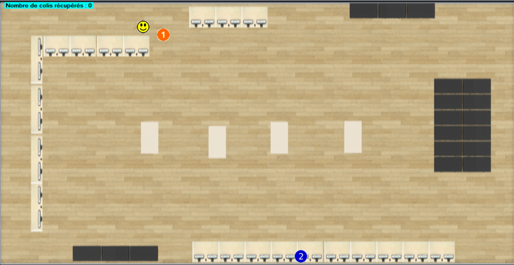

# Package tracking system

Development of a desktop application to allow the location of several parcels located inside, for example in a factory. This application should display the parcels and allow us to retrieve them in the order closest to the parcels.
This application uses UWB technology, and the connection is made via the mqtt protocol.

## Hicheme BEN GAIED

## Tech Stack

**Client:** Windows From

**Server:** C#

## Screen

